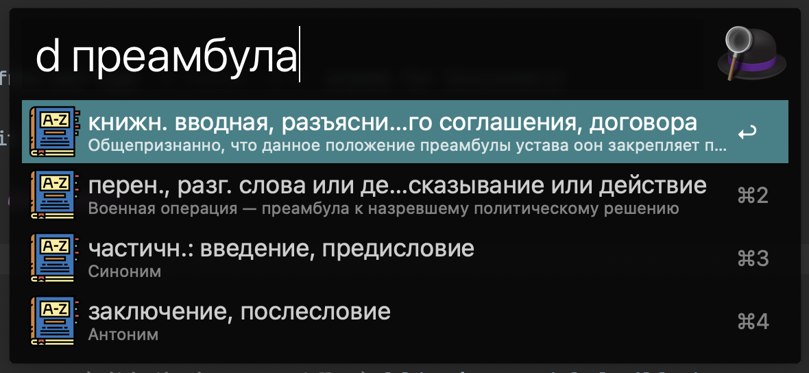
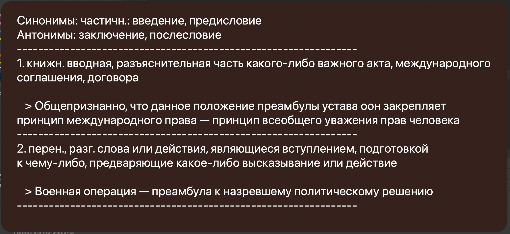

### Installation

[Download](https://github.com/fbjorn/wiki-dictionary-workflow/releases/) Alfred workflow and open it

### Usage

Invoke Alfred and type `d <term>` (`d` stands for Dictionary). Hit enter to see full definition

For now, it works only for Russian words and phrases.

Examples: 





### Local development

```bash
make
```

It will create a `wiki-dictionary-workflow` folder in your default Alfred
installation and add all required source files as symlinks.

Then just open Alfred on Workflows tab, and you'll find it.

---

Made with [Alfred-Workflow](https://github.com/deanishe/alfred-workflow)

Bootstrapped from
[alfred-python-template](https://github.com/fbjorn/alfred-python-template)
